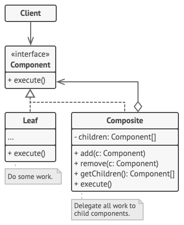
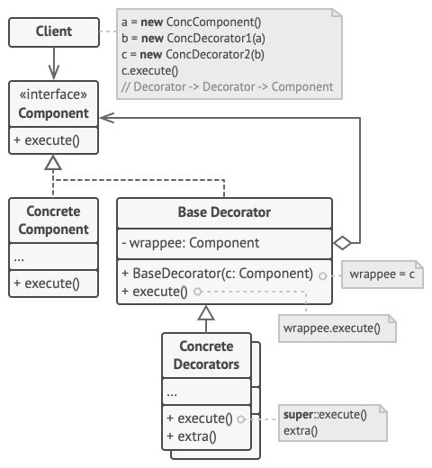

# DESIGN PATTERN SUMMARY

## Table of Contents

- [PRINCIPLES](#PRINCIPLES)

- [CATALOG OF PATTERNS](#CATALOG-OF-PATTERNS)
  - [Creational Patterns](#Creational-Patterns)
  - [Structural Patterns](#Structural-Patterns)
  - [Behavioral Patterns](#Behavioral-Patterns)

- [Patterns](#Patterns)
  - [Factory Method](#Factory-Method)
  - [Abstract Factory](#Abstract-Factory)
  - [Builder](#Builder)
  - [Prototype](#Prototype)
  - [Singleton](#Singleton)
  - [Adapter](#Adapter)
  - [Bridge](#Bridge)
  - [Composite](#Composite)
  - [Decorator](#Decorator)
  - [Facade](#Facade)
  - [Flyweight](#Flyweight)
  - [Proxy](#Proxy)
  - [Chain of Responsibility](#Chain-of-Responsibility)
  - [Command](#Command)
  - [Iterator](#Iterator)
  - [Mediator](#Mediator)
  - [Memento](#Memento)
  - [Observer](#Observer)
  - [State](#State)
  - [Strategy](#Strategy)
  - [Template Method](#Template-Method)
  - [Visitor](#Visitor)

## **PRINCIPLES**

- Encapsulate what varies.
- Favor composition over inheritance.
- Program to interface, not implementation.
- Strive for loosely coupled designs between objects that interact.
- Class should be open for extension but closed for modification. (Open - Closed Principle)
- Depend on abstractions. Do not depend on classes. (Dependency Inversion Principle)
- Only talk to your friends. (Least Knowledge Principle)
- Don't call us, we'll call you. (Hollywood Principle)
- A class should have one reason to change. (Single Responsibility)
- Liskov Substitution Principle.
- Interface Segregation Principle.

## **CATALOG OF PATTERNS**

### **Creational Patterns**

- [Factory Method](#Factory-Method)
- [Abstract Factory](#Abstract-Factory)
- [Builder](#Builder)
- [Prototype](#Prototype)
- [Singleton](#Singleton)

### **Structural Patterns**

- [Adapter](#Adapter)
- [Bridge](#Bridge)
- [Composite](#Composite)
- [Decorator](#Decorator)
- [Facade](#Facade)
- [Flyweight](#Flyweight)
- [Proxy](#Proxy)

### **Behavioral Patterns**

- [Chain of Responsibility](#Chain-of-Responsibility)
- [Command](#Command)
- [Iterator](#Iterator)
- [Mediator](#Mediator)
- [Memento](#Memento)
- [Observer](#Observer)
- [State](#State)
- [Strategy](#Strategy)
- [Template Method](#Template-Method)
- [Visitor](#Visitor)

## **PATTERNS**

### List structure

- :blue_book: **Intent**
- :fist: **Motivation**
- :office: **Structure**
- :bulb: **Applicability**
- :gear: **Implementation**
- :balance_scale: **Consequences**
- :memo: **Sample code**
- :left_right_arrow: **Related patterns**

---

### **Factory Method**
<details>
<summary>Detail</summary>

- :blue_book: **Intent**: A **creational design pattern** provides an interface for creating objects in a superclass, but allows subclasses to alter the type of objects that will be created.

- :fist: **Motivation**:

  - **Problem:** Assuming your client implements `Truck` class and the bulk of your code is in there. And now you want to implement the `Ship` class. But adding `Ship` class would make changes to entire codebase. Moreover, if later you decide to add another class, you will probably need to make all of these changes again.
  - **Solution:**
    - Replacing direct object construction calls (using `new` operator) with a special *factory* method (objects are created via `new` operator in *factory* method). Objects returned by a factory method are often referred to as *products*.
    - All products must have a common base class or interface and the factory method in base class should have its return type declared as this interface.
    - The client code doesn't see a difference between actual products return by various subclasses. The client treat all products as abstract class. The client knows that objects have some methods but don't know how it works.

- :office: **Structure**

  

  - The `Product` interface is implemented by all objects that can be created by the factory method.
  - The concrete `Product` classes implement the `Product` interface.
  - The `Creator` class declares the factory method to return new product objects. The factory method should return the type of `Product` interface.
    - The factory method can be declared as abstract to force all subclasses to implement their own versions (The factory method return default product).
    - Product creation is not the primary responsibility of the creator. It usually has some core business logic logic related.

- :bulb: **Applicability**

  - Use the Factory Method when you don't know the exact types and dependencies of the objects your code should work with. (eg: To adding new product type, you'll only need to create new creator subclass and override factory method).
  - Use the Factory Method when you want to provide for users a way to extend internal components. (By create new subclass inherit creator class and override its factory method).
  - Use the Factory Method when you want to reusing existing objects instead of rebuilding them each time.

- :gear: **Implementation**

  1. Create an interface that all product should implement. This interface should declares methods that make sense in every product.
  2. Add an empty factory method, whose return type should match the product interface, inside the creator class.
  3. Replacing all code which references to product constructors with calls to factory method, while extracting the product creation code into the factory method.
  4. Create a set of creator subclasses for each type of product listed in factory method. Override the factory method in the subclasses and extract appropriate construction code from base method.
  5. If product types doesn't make sense to create subclasses for them, you can reuse the control parameter from the base class in subclasses.
  6. If after all of extraction, the base factory has become empty, you can make it abstract. Otherwise, you can make it a default behavior.

- :balance_scale: **Consequences**

  - **Pros**

    - Avoid coupling between the creator and the concrete products
    - Product creation code is moved into one place (*Single responsibility Principle*)
    - Easy to introduce new types of products without breaking existing code (*Open/Close Principle*)

  - **Cons**

    - The code may become more complicated when you need to introduce a lot of new subclasses.

- :memo: **Sample code** ```App\FactoryPattern\PizzaTestDrive```
- :left_right_arrow: **Related patterns**

  - *Abstract Method* classes are often based on a set of *Factory Method* (The factory method is less complicated and more customizable)
  - You can use *Factory Method* along with *Iterator* to let collection subclasses return different types of iterators.
  - *Prototype* isn't based on inheritance but requires a complicated initialization of cloned object while *Factory Method* is opposite.
  - *Factory Method* is a specialization of *Template Method*.
---
</details>


### **Abstract Factory**
<details>
<summary>Detail</summary>

- :blue_book: **Intent**: a **creational design pattern** that lets you produce families of related objects without specifying their concrete class.

- :fist: **Motivation**

  - **Problem**: Assuming you have a bulk of classes that represent a family of related products consist of `Chair`, `Sofa` and `CoffeeTable`. Each of these products has variants: `Modern`, `Victorian`, `ArtDeco`. You need create a way to create individual furniture objects so that they match other objects of the same family.

  - **Solution**:

    - Explicitly declare interfaces for each distinct product of the product family (implement the `Chair` interface for all chair variant).
    - Declare the `Abstract Factory` interface with a list of creation methods for all products that are the part of the product family (eg. `createChair`, `createSofa`, `createCoffeeTable`). These methods should return abstract product types represented by the interfaces extracted previously.

- :office: **Structure**

  

  - `Abstract Products` declare interfaces for a set of distinct but related products which make up a product family.
  - `Concrete Products` are various implementations of abstract products, grouped by variants. Each abstract must be implemented in all given variants.
  - The `Abstract Factory` interface declares a set of methods for creating each of the abstract products
  - `Concrete Factories` implement creation methods of the abstract factory. Each concrete factory corresponds to a specific variant of products and creates only those product variants.
  - Concrete products created must corresponding abstract products.

- :bulb: **Applicability**

  - Use the Abstract Factory when your code needs to work with various families of related products, but you don't want it to depend on the concrete classes of those products.

- :gear: **Implementation**

  1. Map out a matrix of distinct product types versus variants of these products.
  2. Declare abstract product interfaces for all product types. Then make all concrete product classes implement these interfaces.
  3. Declare the abstract factory interface with a set of creation methods for all abstract products.
  4. Implement a set of concrete factory classes, one for each product variant.
  5. Create factory initialization code somewhere in the app. It should instantiate one of the concrete factory classes, depending on the application configuration or the current environment. Pass this factory object to all classes that construct products.
  6. Scan through the code and find all direct calls to product constructors. Replace them with calls to the appropriate creation method on the factory object.

- :balance_scale: **Consequences**

  - **Pros**

    - You can be sure that the products you're getting from a factory are compatible with each other.
    - You avoid tight coupling between concrete products and client code.
    - *Single Responsibility Principle*. you can extract the product creation code into one place, making code easier to support.
    - *Open/Close Principle*. You can introduce new variants of products without breaking existing client code.
  - **Cons**
    - The code may become more complicated than it should be, since a lot of new interfaces and classes are introduced along with pattern.
- :memo: **Sample code** ```App\FactoryPattern\PizzaTestDrive```
- :left_right_arrow: **Related patterns**

  - *Builder* forces on constructing complex objects stop by step. *Abstract Factory* specializes in creating families of related objects. *Abstract Factory* returns the products immediately, whereas *Builder* lets you run some additional construction steps before fetching the products.
  - *Abstract Factory* classes are often based on a set of *Factory Methods*, but you can also use *Prototype* to compose the methods on these classes.
  - *Abstract Factory* can serve as an alternative to *Facade* when you want to hide the way the subsystem objects are created from the client code.
  - *Abstract Factory* can use along with *Bridge*. This paring is useful when some abstractions defined by *Bridge* can only work with specific implementations. In this case, *Abstract Factory* can encapsulate these relations and hide the complexity from the client code.
  - *Abstract Factories*, *Builders*, *Prototype* can all bee implemented as *Singleton*.

---
</details>

### **Builder**
<details>
<summary>Detail</summary>

- :blue_book: **Intent**: is **a creational pattern** that lets you construct complex object step by step. The pattern allows you to produce different types and representations of an object using the same construction code.

- :fist: **Motivation**

  - **Problem:**

    - For example, you are creating a `House` class. To build a simple house, you need to construct for a lot of things (eg. walls, floor, doors, windows, etc...). Then, you want some parts of your house difference (eg. bigger, brighter house, add some goodies).
    - The simplest solution is to extend the base `House` class and create a set of subclasses to cover all combinations of parameters. But any addition of parameters will require growing this hierarchy.
    - Another approach is create a giant constructor right in the base `House` class with all parameters that control the house object. But this approach make the constructor calls pretty ugly.
  - **Solution:**

    - Extracting the object construction code out of its own class and move it to separate objects called builders (eg. `buildWalls`, `buildDoor`, etc...). By this way, you can only call steps that are necessary for producing a particular configuration of an objects.
    - **Director** (*Optional*) a class contains a series of calls to the builder steps to construct a product.

- :office: **Structure**

  

  - The **Builder** interface declares product construction steps that are common to all types of builders.
  - **Concrete Builders** provides different implementations of the construction steps. Concrete builders may produce products that don't follow the common interface.
  - **Products** are resulting objects created by builders.
  - The **Director** class defines the orders in which to call construction steps, so you can create and reuse specific configurations of products.
  - The **Client** must associate one of the builder objects with the director. However, the director can change to a different builder each time produce something.

- :bulb: **Applicability**

  - Use the Builder pattern to get rid of a *telescopic constructor*.
  - Use the Builder pattern to make your code to be able to create different representations of some product.
  - Use the Builder pattern to construct Composite trees or other complex objects.

- :gear: **Implementation**

  1. Make sure that the common construction steps for building all available product representations are clearly defined.
  2. Declare these steps in base builder interface.
  3. Create a concrete builder class for each of the product representations and implement their construction steps. (Concrete class should implement a method for fetching the result of the construction. This method shouldn't be declared inside the builder interface because builder can construct products that don't have a common interface).
  4. Consider to create a director class.
  5. The client code creates both the builder and the director objects. Before construction starts, the client must pass a builder object to the director.
  6. The construction result can be obtained directly from the director only if all products follow the same interface. Otherwise, the client should fetch the result from the builder.

- :balance_scale: **Consequences**

  - **Pros:**

    - You can construct objects step-by-step, defer construction steps or run steps recursively.
    - You can reuse the same construction code when building various representation of products.
    - *Single Responsibility Principle*. You can isolate complex construction code from the business logic of the product.

  - **Cons:**

    - The overall complexity of the code increases since the pattern requires creating multiple new classes.

- :memo: **Sample code** ```App\BuilderPattern\Planner```
- :left_right_arrow: **Related patterns**

  - *Builder* focuses on constructing complex objects step by step, *Abstract Factory* specializes in creating families of related objects. *Abstract Factory* returns the products immediately, whereas *Builder* lets you run some additional construction steps before fetching the products.
  - *Builder* can be used when creating complex *Composite* trees.
  - *Builder* can combine with *Bridge*: the director class plays the role of the abstraction, while different builders act as implementations.
  - *Abstract Factories*, *Builders*, *Prototypes* can all be implemented as *Singletons*.

---
</details>

### **Prototype**
<details>
<summary>Detail</summary>

- :blue_book: **Intent**: is a **creational design pattern** that lets you copy existing objects without making your code dependent on their class.

- :fist: **Motivation**

  - **Problem:** Say you have an object, and you want to create an exact copy of it. First, you have to create a new object of the same class. Then you have go to through all the fields of the original object and copy their values over to the new object.

    - **Solution:**

      - Declare a common interface for all objects that support cloning. Usually, such an interface contains a single `clone` method.
      - The `clone` method creates an object of the current class and carries over all of the field values of the old object into the new one (even `private` fields).
      - An object that supports cloning is called *prototype*.

- :office: **Structure**

  

  - The **Prototype** interface declares the cloning methods (`clone` method).
  - The **Concrete Prototype** class implements the cloning method.
  - The **Client** cam produce a copy of any object that follows the prototype interface.

- :bulb: **Applicability**

  - Use the Prototype pattern when your code shouldn't depend on the concrete classes of objects that you need to copy.
  - Use the pattern when you want reduce the number of subclasses that only differ in the way they initialize their respective objects.

- :gear: **Implementation**

  1. Create the prototype interface and declare the `clone` method in it.
  2. A prototype class must define the alternative constructor that accepts an object of that class as an argument. The constructor must copy the values of all fields defined in the class from the passed object into the newly created instance. If you're changing a subclass, you must call the parent constructor to let the superclass handle the cloning of it's private fields. If programing language does not support method overloading, copying the object's data into newly created clone will have to be performed within the `clone` method.
  3. Optionally, create a centralized prototype registry to store a catalog of frequently used prototypes.

- :balance_scale: **Consequences**

  - **Pros:**

    - You can clone objects without coupling to their concrete classes.
    - You can get rid of repeated initialization code in favor of cloning pre-built prototypes.
    - You can produce complex objects more conveniently.
    - You get an alternative to inheritance when dealing with configuration presets for complexing objects.

  - **Cons:**

    - Cloning complex objects that have a circular references might be very tricky.

- :memo: **Sample code** ```App\PrototypePattern\PrototypeTestDriven```
- :left_right_arrow: **Related patterns**

  - *Abstract Factory* classes are often based on a set of *Factory Methods*, but you can also use *Prototype* to compose the methods on these classes.
  - *Prototype* can help when you need to save copies of *Commands* (*Command Pattern*) into history.
  - Designs that make heavy use of *Composite* and *Decorator* can often benefits from using *Prototype*. Applying the pattern lets you clone complex structures instead of re-constructing them from scratch.
  - *Prototype* isn't based on inheritance, so it doesn't have its drawbacks. On the other hand, *Prototype* requires a complicated initialization of the cloned object. *Factory Method* is based on inheritance but doesn't require an initialization step.
  - Sometimes *Prototype* can be a simpler alternative to *Memeto*.
  - *Abstract Factories*, *Builders*, *Prototypes* can all be implemented as *Singletons*.

---
</details>

### **Singleton**
<details>
<summary>Detail</summary>

- :blue_book: **Intent**: is a **creational design pattern** that lets you ensure that a class has only one instance.

- :fist: **Motivation**

  - **Problem:** The **Singleton pattern** solves two problems at the same time which violating the *Single Responsibility Principle*.

    - Ensure that a class has just a single instance.
    - Provide a global access point to that instance.

  - **Solution:** All implementations of the *Singleton* have these two steps in common:

    - Make the default constructor private, to prevent other objects from using `new` operator with the `Singleton` class.
    - Create a static creation method that acts as a constructor. This method calls the private constructor to create an object and save it in a static field. All following calls to this method return cached object.

- :office: **Structure**

  

  - The **Singleton** class declares the static method `getInstance` the returns the same instance of its own class. The *Singleton*'s constructor should be hidden from the client code. Calling the `getInstance` method should be the only way of getting the *Singleton* object.

- :bulb: **Applicability**

  - Use the Singleton pattern when a class in your program should have a single instance available to all clients. (e.g as single database object).
  - Use the Singleton pattern when you need stricter control over global variables.

- :gear: **Implementation**

  1. Add a private static field to the class for storing the singleton instance.
  2. Declare a public static creation method for getting the singleton instance.
  3. The static method should create a new object on it first call and put it into the static field. The method should always return that instance on all subsequent calls.
  4. Make the constructor of the class private. The static method of the class will still be able to call the constructor, but not the other objects.
  5. Go over the client code and replace all direct calls to the singleton's constructor with calls to its static creation method.

- :balance_scale: **Consequences**

  - **Pros:**

    - You can be sure that a class has only a single instance.
    - You gain a global access point to that instance.
    - The singleton object is initialized only when it's requested for the first time.

  - **Cons:**

    - Violates the *Single Responsibility Principle*. The pattern solves two problems.
    - The Singleton pattern can mask bad design (eg. components know too much about each other).
    - The pattern requires special treatment in a multi-threaded environment, so that multiple threads won't create a singleton object several times.
    - It may be difficult to unit test the client code of the Singleton because many test frameworks rely on inheritance when producing mock objects.

- :memo: **Sample code** ```App\SingletonPattern\ChocolateFactory```
- :left_right_arrow: **Related patterns**

  - A *Facade* class can often transformed into a *Singleton* since a single facade object is sufficient in most cases.
  - *Flyweight* would resemble *Singleton* if you somehow managed to reduce all shared states of the objects to just one flyweight object. But theres are two fundamental differences between these patterns:

    - There should be only one *Singleton* instance, whereas a *Flyweight* class can have multiple instances with different intrinsic states.
    - The *Singleton* object can be mutable. **Flyweight* object are immutable.

  - *Abstract Factories*, *Builders*, *Prototypes* can all be implemented as *Singletons*.

---
</details>

### Adapter
<details>
<summary>Detail</summary>

- :blue_book: **Intent**: is a **structural design pattern** that allows objects with incompatible interfaces to collaborate.

- :fist: **Motivation**

  - **Problem:**

    - Imagine that you're creating stock market monitoring app which downloads the stock data from multiple sources in XML format. Then you want to improve app by integrating a smart 3rd-party analytics library. But the analytics library works with data in JSON format.
    - You could change the library to work with XML but this might break some existing code that relies on library.

  - **Solution:**

    - You can create an special object called *adapter* that converts the interface of one object so that another object can understand it.
    - An adapter wraps one of the objects to hide complexity of conversion happening behind the scenes. The wrapped object isn't even aware of the adapter.

- :office: **Structure**

  

  - The **Client** is a class that contains the existing business logic of the program.
  - The **Client Interface** describes a protocol that other classes must follow to be able to collaborate with the client code.
  - The **Service** is some useful class (e.g 3rd-party or legacy). The client can't use this class directly because it has an incompatible interface.
  - The **Adapter** is a class that's able to work with both the client and the service: it implements the client interface, while wrapping the service object. The adapter receives calls from the client via the adapter interface and translates them into calls to the wrapped service object in a format it can understand.
  - The client code doesn't get coupled to the concrete adapter class as long as it works with the adapter via the client interface.
  - *Class Adapter*: This implementation use inheritance: the adapter inherits interfaces from both objects at the same time (This approach can only be implemented in programing languages that support multiple inheritance).

- :bulb: **Applicability**

  - Use the Adapter pattern when you want to use some existing class, but its interface isn't compatible with the rest of your code.
  - Use the pattern when you want to reuse several existing subclasses that lack some common functionality that can't be added to the superclass.

- :gear: **Implementation**

  1. Make sure you have at least two classes with incompatible interfaces:
     - An useful service class, which you can't change.
     - One or several client classes that would benefits from using the service class.
  2. Declare the client interface and describe how clients communicate with the service.
  3. Create the adapt class and make it follow the client interface. Leave all method empty for now.
  4. Add a field to the adapter class to store a reference to the service object. The common practice is to initialize this field via the constructor, but sometime it's more convenient to pass it to the adapter when calling its method.
  5. One by one, implement all methods of the client interface in the adapter class. The adapter should delegate most of the real work to the service object, handling only the interface or data format convention.
  6. The client should use the adapter via the client interface. This will let you change or extend the adapters without affecting the client code.

- :balance_scale: **Consequences**

  - **Pros:**

    - *Single Responsibility Principle*. You can separate the interface or date conversion code from the primary business logic of the program.
    - *Open/Close Principle*. You can introduce new types of adapters into the program without breaking the existing client code, as long as they work with the adapters through the client interface.
- :memo: **Sample code** ```App\AdapterPattern\DuckTestDrive```
- :left_right_arrow: **Related patterns**

  - *Bridge* is usually designed up-front, letting you develop parts of an application independently of each other. On the other hand, *Adapter* is commonly used with an existing app to make some otherwise-incompatible classes work together nicely.
  - *Adapter* changes the interface of existing object, while *Decorator* enhances an object without changing its interface. In addition, *Decorator* support recursive composition, which isn't possible when using *Adapter*.
  - *Adapter* provides a different interface to wrapped object, *Proxy* provides it with the same interface, and *Decorator* provides it with an enhanced interface.
  - *Facade* defines a new interface for existing objects, whereas *Adapter* tries to make the existing interface usable. *Adapter* usually wraps just one object, while *Facade* work with an entire subsystem of objects.
  - *Bridge*, *State*, *Strategy* (and to some *Adapter*) have very similar structures. Indeed, all of these patterns are based on composition, which is delegating work to other objects. However, they all solve different problems.

---
</details>

### Bridge
<details>
<summary>Detail</summary>

- :blue_book: **Intent**: is a **structural design patterns** that lets you split a large class or a set of closely related classes into two separate hierarchies-abstraction and implementation-which can be developed independently of each other.

- :fist: **Motivation**

  - **Problem:** Say you have a geometric `Shape` class with a pair of subclasses: `Circle` and `Square`. You want to extend this class hierarchy to incorporate colors, so you plan to create `Red` and `Blue` shape subclasses. However, since you already have two subclasses, you'll need to create four class combinations such as `BlueCircle` and `RedCircle`. Adding new shape types and colors to the hierarchy will grow it exponentially.

  - **Solution:** The bridge pattern attempts to solve this problem by switching from inheritance to the object composition. What this mean is that you extract one of the dimensions into a separate class hierarchy, so that the original classes will reference an object of the new hierarchy, instead of having all of its states and behaviors within one class.

- :office: **Structure**

  

  - The **Abstraction** provides high-level control logic. It relies on the implementation object to do the actual low-level work.
  - The **Implementation** declares the interface that's common for all concrete implementations. An abstraction can only communicate with an implementation object via methods that are declared in the interface.

    - The abstraction may list the same methods as the implementation, but usually the abstraction declares some complex behaviors that rely on a wide variety of primitive operations declared by the implementation.

  - **Concrete Implementations** contain platform-specific code.

  - **Refined Abstractions** provide variants of control logic. Like their parents, they work with different implementations via the general implementation interface.

  - Usually, the **Client** is only interested in working with the abstraction. However, it's the client's job to link the abstraction object with one of the implementation objects.

- :bulb: **Applicability**

  - Use the Bridge pattern when you want to divide and organize a monolithic class that has several variants of some functionality (e.g. class can work various database server).

  - Use the pattern when you need to extend a class in several orthogonal (independent) dimensions.

  - Use the Bridge if you need to be able to switch implementations at runtime.

- :gear: **Implementation**

  1. Identify the orthogonal dimensions in your class. These independent concepts could be: abstraction/platform, domain/infrastructure, front-end/back-end, or interface/implementation.
  2. See what operations the client needs and define them in the base abstractions class.
  3. Determine the operations available on all platforms. Declare the ones that the abstraction needs in the general
  4. For all platforms in your domain create concrete implementation classes, but make sure they all follow the implementation interface.
  5. Inside the abstraction class, add a reference field for the implementation type. The abstraction delegates most of work to the implementation object that's referenced in that field.
  6. If you have several variants of high-level logic, create refined abstractions for each variant by extending the base abstraction class.
  7. The client code should pass an implementation object the abstraction's constructor to associate one with the other. After that, the client can forget about the implementation and work only with the abstraction object.

- :balance_scale: **Consequences**

  - **Pros:**

    - You can create platform-independent classes and apps.
    - The client code works with high-level abstractions. It isn't exposed to the platform details.
    - *Open/Closed Principle*. You can introduce new abstractions and implementations independently from each other.
    - *Single Responsibility*. You can focus on high-level logic in the abstraction and on platform details in the implementation.

  - **Cons:**

    - You might take the code more complicated by applying the pattern to a highly cohesive class.

- :memo: **Sample code**

  - ```App\BridgePattern\ControlTV```
  - ```App\BridgePattern\PageRender```

- :left_right_arrow: **Related patterns**

  - *Bridge* is usually designed up-front, letting you develop parts of application independently of each other. On the other hand, *Adapter* is commonly used with an existing app to make some otherwise-incompatible classes work together nicely.
  - *Bridge*, *State*, *Strategy* (*Adapter*) have very similar structures. Indeed, all of these patterns are based on composition, which is delegating work to to other objects.
  - You can use *Abstract Factory* along with *Bridge*. When some abstractions defined by *Bridge* can only work with specific implementations, *Abstract Factory* can encapsulate these relations and hide the complexity from the client code.
  - You can combine *Builder* with *Bridge*: the director class plays the role of the abstraction, while different builders act as implementations.

---
</details>

### Composite
<details>
<summary>Detail</summary>

- :blue_book: **Intent** is a ***structural design pattern** that lets you compose objects into tree structures and then work these structural as if they were individual objects.

- :fist: **Motivation**

  - **Problem:** Imagine you have two types of objects: `Products` and `Boxes`. A `Box` can contain a several `Products` as well as a number of a smaller `Boxes`. These little `Boxes` can also hold some `Products` or even smaller `Boxes`, and so on. The problem comes that you want to determine the total price of all products in the boxes.
  - **Solution:**

    - The Composite pattern suggests that you work with `Products` and `Boxes` through a common interface which declares a method for calculating the total price.
    - When calculating total prices, for a product, it's simple return product's price. For a box, it'd go over each item the box contains, ask its price and then return a total for this box. If one of these items were a smaller box, that box would also start going over its contents and so on, util the prices of all inner components were calculated.

- :office: **Structure**

  

  - The **Composite** interface describes operations that are common to both simple and complex elements of the tree.
  - The **Leaf** is a basic element of a tree that doesn't have sub elements. Usually, leaf components end up doing most of the real work, since they don't have anyone to delegate the work to.
  - The **Container** (composite) is an element that has sub-elements: leaves and other containers. A container doesn't know the concrete classes of its children. It works with all sub-elements only via the component interface.
  - The **Client** works with all elements through the component interface. As a result, the client can work in the same way with both simple or complex elements of the tree.

- :bulb: **Applicability**

  - Use the Composite pattern when you have to implement a tree-like object structure.
  - Use the pattern when you want the client code to treat both simple and complex elements uniformly.

- :gear: **Implementation**

  1. Make sure that the core model of your app can be represented as a tree structure. Try to break it down into simple elements and containers. Remember that containers must be able to contain both simple elements and other containers.
  2. Declare the component interface with a list of methods that make sense for both simple and complex components.
  3. Create a leaf class to represent simple elements. A program may have multiple different leaf classes.
  4. Create a container class to represent complex elements. In this class, provide an array field for storing references to sub-elements. The array must be able to store both leaves and containers, so make sure it's declared with the component interface type.
   - While implementing the methods of the component interface, Remember that a container is supposed to be delegating most of the work to sub-elements.
  5. Finally, define the methods for adding and removal of child elements in the container.
   - **Note:** these operations can be declared in the component interface. This would violate the *Interface Segregation Principle* because the methods will be empty in the leaf class. However, the client will be able to treat all the elements equally, even when composing the tree.

- :balance_scale: **Consequences**

  - **Pros:**

    - You can work with complex tree structures more conveniently: use polymorphism and recursion to your advantage.
    - *Open/Close PrincipleL* You can introduce new element types into the app without breaking the existed code, which now works with the object tree.

  - **Cons:**

    - It might be difficult to provide a common interface for classes whose functionality differs to much. In certain scenarios, you'd need to overgeneralize the component interface, making it harder to comprehend.

- :memo: **Sample code** `App\CompositePattern\MenuTestDrive`

- :left_right_arrow: **Related patterns**

  - You can use *Builder* when creating complex *Composite* trees because you can program its construction steps to work recursively.
  - *Chain of Responsibility* is often used in conjunction with *Composite*. In this case, when leaf component gets a request, it may pass it through the chain of all the parent components down to the root of the object tree.
  - You can use *Iterators* to traverse *Composite* trees.
  - You can use *Visitor* to execute an operation over an entire *Composite* tree.
  - You can implement shared leaf nodes of the *Composite* tree as *Flyweights* to save some RAM.
  - *Composite* and *Decorator* have similar structure diagrams since both rely on recursive composition to organize an open-ended number of objects.

    - A *Decorator* is like a *Composite* but only has one child component. There's another significant difference: *Decorator* adds additional responsibilities to the wrapped object, while *Composite* just "sums up" its children's result.
    - However, the patterns can also cooperate: you can use *Decorator* to extend the behavior of a specific object in the *Composite* tree.

  - Designs that make heavy use of *Composite* and *Decorator* can often benefit from using *Prototype*. Applying the pattern lets you clone complex structures instead of re-constructing them from scratch.

---
</details>

### Decorator
<details>
<summary>Detail</summary>

- :blue_book: **Intent** is a **structural design pattern** that lets you attach new behaviors to objects by placing these objects inside special wrapper objects that contain behaviors.

- :fist: **Motivation**

  - **Problem:**

    - Imagine that you working on a notification library which lets other programs notify their users about important events. You realize that users of the library expect more than just email notifications. Many of them would like to receive an SMS about critical issues. Others would like to be notified on Facebook and, of course, the corporate users would love to get Slack notifications.
    - It can easily solve by extending the `Notifier` class and put the additional notification method into new subclasses. But then someone reasonably asked you to use several notification types at once. If you tried to address that problem by creating special subclasses which combined several notification methods within one class. However, it quickly became apparent that this approach would bloat code immensely, not only the library code but the client code as well.

  - **Solution:**

    - Extending a class is the first thing that comes to mind when you need to alter an object's behavior. However, inheritance as several serious caveats that you need to be aware of.

      - Inheritance is static. You can't alter the behavior of an existing object at runtime. You can only replace the whole object with another one that's created from a different subclass.
      - Subclasses can have just one parent class. In most languages, inheritance doesn't let a class inherit behaviors of multiple classes at the same time.

    - One of the ways overcome these caveats is y using *Aggregation* or *Composition* instead of *Inheritance*. Both of the alternatives work almost the same way: one object has a reference to another and delegates it some work, whereas with inheritance, the object itself is able to do that work, inheriting the behavior from its subclass.

    - With this new approach you can easily substitute the linked *helper* object with another, changing the behavior of the container at runtime. An object can use the behavior of various classes, having references to multiple objects and delegating them all kinds of work. 
    - The Decorator pattern which developed base on aggregation/composition also called *wrapper*. A wrapper is an object that can be linked with some target object. The wrapper container the same set of methods as the target and delegates to it all requests it receives. However, the wrapper may alter the result by doing something either before or after it passes the request to target.

- :office: **Structure**

  

  - The **Component** declares the common interface for both wrappers and wrapped objects.
  - **Concrete Component** is a class of objects being wrapped. It defines the basic behavior, which can be altered by decorators.
  - The **Base Decorator** class has a field for referencing a wrapped object. The field's type should be declared as the component interface so it can contain both concrete components and decorators. The base decorator delegates all operations to the wrapped object.
  - **Concrete Decorators** defines extra behaviors that can be added to components dynamically. Concrete decorators override methods of the base decorator and execute their behavior either before or after calling the parent method.
  - The **Client** can wrap components in multiple layers of decorators, as long as it works with all objects via the component interface.

- :bulb: **Applicability**

  - Use the Decorator pattern when you need to be able to assign extra behaviors to objects at runtime without breaking the code that uses these objects.
  -Use the pattern when it's awkward or not impossible to extend an object's behavior using inheritance.

- :gear: **Implementation**

  1. Make sure your business domain can be represented as a primary component with multiple optional layers over it.
  2. Figure out what methods are common to both the primary component and the optional layers. Create a component interface and declare those methods there.
  3. Create a concrete component class and define the base behavior in it.
  4. Create a base decorator class. It should have field for storing a reference to a wrapped object. The field should be declared with the component interface type to allow linking to concrete components as well as decorators. The base decorator must delegate all work to the wrapped object.
  5. Make sure all classes implement the component interface.
  6. Create concrete decorators by extending them from the base decorator. A concrete decorator must execute its behavior before or after the call to the parent method (which always delegates to the wrapped object).
  7. The client code must be responsible for creating decorators and composing them in the way the client needs.

- :balance_scale: **Consequences**

  - **Pros:**

    - You can extend an object's behavior without making a new subclass.
    - You can add or remove responsibilities from an object at runtime.
    - You can combine several behaviors by wrapping an object into multiple decorators.
    - *Single Responsibility Principle.* You can divide a monolithic class that implements many possible variants of behavior into several smaller classes.

  - **Cons:**

    - It's hard to remove a specific wrapper from the wrappers stack.
    - It's hard to implement a decorator in such a way that its behavior doesn't depend on the order in the decorators stack.
    - The initial configuration code of layers might look pretty ugly.

- :memo: **Sample code** `App\DecoratorPattern\StarbuzzCoffee`
- :left_right_arrow: **Related patterns**

  - *Adapter* changes the interface of existing object, while *Decorator* enhances an object without changing its interface. *Decorator* supports recursive composition, which isn't possible when you use *Adapter*.
  - *Adapter* provides a different interface to the wrapped object, *Proxy* provides it with the same interface, and *Decorator* provides it with and enhanced interface.
  - *Chain of Responsibility* and *Decorator* have very similar class structures. Both patterns rely on recursive composition to pass the execution through a series of objects. However, there are several crucial differences.

    - The *CoR* handlers can execute arbitrary operations independently of each other. They can also stop passing the request further at any point. On the hand, various *Decorators* can extend the object's behavior while keeping it consistent with the base interface. In addition, decorators aren't allowed to break the flow of the request.

  - *Composite* and *Decorator* have similar structure diagrams since both rely on recursive composition to organize an open-ended number of objects.

    - A *Decorator* is like a *Composite* but only has one child component. There's another significant difference: *Decorator* adds additional responsibilities to the wrapped object, while *Composite* just "sums up" its children's result.
    - The patterns can also cooperate: you can use *Decorator* to extend the behavior of a specific object in the *Composite* tree.

  - Designs that make heavy use of *Composite* and *Decorator* can often benefit from using *Prototype*. Applying the pattern lets you clone complex structures instead of re-constructing them from scratch.
  - *Decorator* lets you change the skin of an object, while *Strategy* lets you change the guts.
  - *Decorator* and *Proxy* have similar structures, but very different intents. Both patterns are built on the composite principle, where one object is supposed to delegate some of the work to another. The difference is that a *Proxy* usually manages the life cycle of its service object on its own, whereas the composition of *Decorators* is always controlled by the client.

---
</details>

### Facade
<details>
<summary>Detail</summary>

- :blue_book: **Intent** is a **structural design pattern** that provides a simplified interface to a library, a framework, or any other complex set of classes.

- :fist: **Motivation**

  - **Problem:**

    - Imagine that you must make your code work with a board set of objects that belongs to a sophisticated library or framework. Ordinarily, you'd need to initialize all of those objects, keep track of dependencies, execute methods in the correct order, and so on.
    - As a result, the business logic of classes would become tightly coupled to the implementation details of 3rd-party, making it hard to comprehend and maintain.

  - **Solution:**

    - A facade is a class that provides a simple interface to complex subsystem which contains lots of moving parts. A facade might provide limited functionality in comparison to working with the subsystem directly. However, it includes only those features that clients really care about.
    - Having a facade is handy when you need to integrate your app with a sophisticated library that has dozens of features, but you just need a tiny bit of its functionality.

- :office: **Structure**

  

  - The **Facade** provides convenient access to a particular part of the subsystem's functionality. It knows where to direct the client's request and how to operate all the moving parts.
  - An **Additional Facade** class can be created to prevent polluting a single facade with unrelated features that might make it yet another complex structure. Additional facades can be used by both clients and other facades.
  - The **Complex Subsystem** consists of dozens of various objects. To make them all do something meaningful, you have to dive deep into the subsystem implementation details, such as initializing objects in the correct order and supplying them with data in the proper format.
 - The **Client** uses the facade instead of calling the subsystem objects directly.

- :bulb: **Applicability**

  - Use the Facade pattern when you need to have a limited but straightforward interface to a complex subsystem.
  - Use the Facade when you want to structure a subsystem into layers.

- :gear: **Implementation**

  1. Check whether it's possible to provide a simpler interface than what an exiting subsystem already provides. You're on the right track if this interface makes the client code independent from many of the subsystem's classes.
  2. Declare and implement this interface in a new facade class. The facade should redirect the calls from the client code to appropriate objects of the subsystem. The facade should be responsible for initializing the subsystem and managing its further life cycle unless the client code already does this.
  3. To get tge full benefit from the pattern, make all the client code communicate with the subsystem only via the facade. Now the client code is protected from any changes in the subsystem code.
  4. If the facade becomes too big, consider extracting part of its behavior to a new, refined facade class.
- :balance_scale: **Consequences**

  **Pros:** You can isolate your code from the complexity of a subsystem.
  **Cons:** A facade can become a god object coupled to all classes of an app.

- :memo: **Sample code** `App\FacadePattern\HomeTheaterTestDrive`

- :left_right_arrow: **Related patterns**

  - *Facade* defines a new interface for existing objects, whereas *Adapter* tries to make the existing interface usable. *Adapter* usually wraps just one object, while *Facade* works with an entire subsystem of objects.
  - *Abstract Factory* can serve as an alternative to *Facade* when you only want to hide the way the subsystem objects are created from the client code.
  - *Flyweight* shows how to make lots of little objects, whereas *Facade* shows how to make a single object that represents an entire subsystem.
  - *Facade* and *Mediator* have similar jobs: then try to organize collaboration between lots of tightly coupled classes.
    - *Facade* defines a simplified interface to a subsystem objects, but it doesn't introduce any new functionality. The subsystem itself is unaware of the facade. Objects within the subsystem can communicate directly.
    - *Mediator* centralized communication between components of the system. The components only know about the mediator object and don't communicate directly.
  - A *Facade* class can often be transformed into a *Singleton* since a single facade object is sufficient in most cases.
  - *Facade* is similar to *Proxy* in that both buffer a complex entity and initialize it on its own. Unlike *Facade*, *Proxy* has the same interface as its service object, which makes them interchangeable.

---
</details>

### Flyweight
<details>
<summary>Detail</summary>

- :blue_book: **Intent** is a **structural design pattern** that lets you fit more objects into the available amount of RAM by sharing common parts of state between multiple objects instead of keeping all of the data in each object.

- :fist: **Motivation**

  - **Problem:** When you creating a simple video game with a vast quantities of bullets, missiles and shrapnel from explosions, this can cause an application crash because of an insufficient amount of RAM. The actual problem was related to particle system. Each particle, such as a bullet, etc..., was presented by a separate object containing a plenty of data.
  - **Solution:**

    + The constant data of an object is usually called the intrinsic state. It lives within the object; other objects can only read it, not change it. The rest object the object's state, often altered from the outside by other objects, is called the extrinsic state.
    + The Flyweight pattern suggests that you stop storing the extrinsic state inside object. Instead, you should pass this state to specific methods which rely on it. Only the intrinsic stays within the object, letting you reuse in it different contexts. As a result, you need fewer of these objects since they only differ in the intrinsic state, which has much fewer variations then the extrinsic. Now, the object that only stores the intrinsic state called a flyweight.
    + The extrinsic state, in most cases, stored in the container object, which aggregates objects before we apply the pattern.
    + Since the same flyweight can be used in different contexts, you have to make sure that its state can't be modified. A flyweight should initialize its state just once, via constructor parameters. It shouldn't expose any setters or public fields to other objects.
    + Flyweight factory: You can create a factory method that manages a pool of existing flyweight objects. The method accepts the intrinsic state of the desired flyweight from a client, looks for an existing object matching this state and returns if it was found. If not, it creates a new flyweight and ads it to the pool.

- :office: **Structure**

  

  - The Flyweight pattern is merely an optimization. Before applying it, make sure your program does have the RAM consumption problem related to having massive number of similar objects in memory at the same time. Make sure that this problem can not be solved in any other meaningful way.
  - The **Flyweight** class contains the portion of the original object's state that can be shared between multiple objects. The same flyweight object can be used in many different contexts. The state stored in a flyweight is called intrinsic. the state passed to the flyweight's methods is called extrinsic.
  - The **Context** class contains the extrinsic state, unique across all original objects. When a context is paired with one of the flyweight objects, it represents the full state of the original object.
  - Usually, the behavior of the original object remains in the flyweight class. In this case, whoever calls a flyweight's method must also pass appropriate bits of the extrinsic state into the method's parameters. On the other hand, the behavior can be moved to the context class, which would use the linked flyweight merely as a data object.
  - The **Client** calculates or stores the extrinsic state of flyweights. From the client's perspective, a flyweight is a Template object which can be configured at runtime by passing some contextual data into parameters of its methods.
  - The **Flyweight Factory** manages a pool of existing flyweights. With the factory, clients don't create flyweight directly. Instead, the call the factory, passing it bits of the intrinsic state of the desired flyweight, The factory looks over previously created flyweight and either returns an existing one that matches search criteria or creates a new one if nothing found.

- :bulb: **Applicability**

  - Use the Flyweight pattern only when your program must support a huge number of objects which barely fit into available RAM.

- :gear: **Implementation**

  1. Divide fields of a class that will become a flyweight into two parts:
   - The intrinsic state: the fields that contain unchanging data duplicated across many objects.
   - The extrinsic state: the fields that contain contextual data unique to each object.
  2. Leave the fields that represent the intrinsic state in the class, but make sure they're immutable. They should take their initial values only inside the construction.
  3. Go over methods that use fields of the extrinsic state. For each field used in the method, introduce a new parameter and use it instead of the field.
  4. Optionally, create a factory class to manage the pool of the flyweights. It should check for an existing flyweight before creating a new one. Once the factory is in place, clients must only request flyweights through it. They should describe the desired flyweight by passing its intrinsic state to the factory.
  5. The client must store or calculate values of the extrinsic state (context) to be able to call method of flyweight objects. For the sake of convenient, the extrinsic state along with the flyweight-referencing field may be moved to a separate context class.

- :balance_scale: **Consequences**

  - **Pros**: You can save a lots of RAM, assuming your program has tons of similar objects.
  - **Cons**: 
    - You must trading RAM over CPU cycles when some of the context data needs to be recalculated each time somebody calls a flyweight method.
    - The code becomes much more complicated. New team members will always be wondering why the state of an entity was separated in a such way.

- :memo: **Sample code** 

  - `App\FlyweightPattern\TreeManager`
  - `App\FlyweightPattern\FlyWeightManager`
- :left_right_arrow: **Related patterns**

  - You can implement shared leaf nodes of the *Composite* tree as *Flyweights* to save some RAM.
  - *Flyweight* shows how to make lost of little objects, whereas *Facade* shows hoe to make a single object that represents an entire subsystem.
  - *Flyweight* would resemble *Singleton* if you somehow managed to reduce all shared states of the objects to just one flyweight object. But there are two fundamental differences between these patterns:
    - There should be only one *Singleton* instance, whereas a *Flyweight* class can have multiple instances with different intrinsic states.
    - The *Singleton* object can be mutable. *Flyweight* objects are immutable.

---
</details>

### Proxy
<details>
<summary>Detail</summary>

- :blue_book: **Intent** is a **structural design pattern** that lets you provide a substitute or placeholder for another object. A proxy controls access to the original object, allow you to perform something either before or after the request get through to the original object.

- :fist: **Motivation**

  - **Problem:** For example, you have a massive object the consume a vast amount of system resources. You need it time to time, but not always. You could implement lazy initialization: create object only when it's actually needed. All of the object's client would need to execute some deferred initialization code. This would probably cause a lot of code duplication. In an ideal would, we'd want to put this code directly into our object's class, but that isn't always possible. For instance, the class may be part of a closed 3re-party library.
  - **Solution:** 
    - The proxy pattern suggests that you create a new proxy class with the same interface as an original service object. Then you update your app so that it passes the proxy object to all of the original object's client. Upon receiving a request from a client, the proxy creates a real service object and delegates all the work to it.
    - With the proxy pattern, you can execute something either before or after the primary logic of the class, the proxy lets you do this without changing that class. Since the proxy implements the same interface as the original class, it can be passed to any client that expects a real service object.

- :office: **Structure**

  

  - The Service Interface declares the interface of the Service. The proxy must follow this interface to be able to disguise itself as a service object.
  - The Service is a class provides some useful business logic.
  - The Proxy class has reference field that points to a service object. After the proxy finishes its processing (e.g, lazy initialization, logging, access control, caching, etc), it passes the request to the service object. Usually, proxies manage the full lifecycle of their service objects.
  - The Client should work with both services and proxies via the same interface. This way you can pass a proxy into any code that expects a service object.

- :bulb: **Applicability**

  - Lazy initialization (virtual proxy). This is when you have a heavyweight service object that wastes system resources by being always up, even though you only need it from time to time.
  - Access control (protection proxy). This is when you want only specific clients to be able to use the service object.
  - Local execution of a remote service (remote proxy). This is when the service object is located on a remote server.
  - Logging requests (logging proxy). This is when you want to keep a history of requests to the service object.
  - Caching request results (caching proxy). This is when you need to cache results of client requests and manage the life cycle of this cache, especially if results are quite large.
  - Smart reference. This is when you need to be able to dismiss a heavyweight object once there are no clients that use it.

- :gear: **Implementation**

  1. If there's no pre-existing service interface, create one to make proxy and service objects interchangeable. Extracting the interface from the service class isn't always possible, because you'd need to change all of the service's clients to use that interface. Plan B is to make the proxy a subclass of the service class, and this way it'll inherit the interface of the service.
  2. Create the proxy class. It should have a field for storing a reference to the service. Usually, proxies create and manage the whole file cycle of their services. On rare occasions, a service is passed to the proxy via a constructor by the client.
  3. Implement the proxy methods according to their purposes. In most cases, after doing some work, the proxy should delegate the work to the service object.
  4. Consider introducing a creation method that decides whether the client gets a proxy or a real service. This can be s simple static method in the proxy class or a full-blown factory method.
  5. Consider implementing lazy initialization for the service object.

- :balance_scale: **Consequences**

  - **Pros:**
    - You can control the service object without clients knowing about it.
    - You can manage the lifecycle of the service object when clients don't care about it.
    - The proxy works even if the service object isn't ready or is not available.
    - Open/Closed Principle. You can introduce new proxies without changing the service or clients.
  - **Cons:**
    - The code may become more complicated since you need to introduce a lot of new classes.
    - The response from the service might get delayed.

- :memo: **Sample code**
  - `App\ProxyPattern\SimpleDownloaderTestDrive`
  - `App\ProxyPattern\PersonBeanTestDrive`

- :left_right_arrow: **Related patterns**
  - *Adapter* provides a different interface to the wrapped object, *Proxy* provides it with the same interface, and *Decorator* provides it with an enhanced interface.
  - *Facade* is similar to *Proxy* in that both buffer a complex entity and initialize it on it own. Unlike *Facade*, *Proxy* has the same interface as its service object, which makes them interchangeable.
  - *Decorator* and *Proxy* have similar structures, but very different intents. Both patterns are built on the composition principle, where one object is supposed to delegate some of the work to another. The difference is that a *Proxy* usually manages the life cycle of its service object on its own, whereas the composition of *Decorator* is always controlled by the client.

---
</details>

### Chain of Responsibility
<details>
<summary>Detail</summary>

- :blue_book: **Intent** is a **behavior design pattern** that lets you pass requests along a chain of handlers. Upon receiving a request, each handler devices either to process the request or to pass it to the next handler in the chain.

- :fist: **Motivation**
  - **Problem:**
    - Imagine that you're working on an online ordering system. You want to restrict access to the system so only authenticated users can create orders. Also, users who have administrative permissions must have full access to all orders.
    - After a bit of planning, you realized that these checks must be performed sequentially. The application can attempt to authenticate a user to system whenever it receives a request that contain the user's credentials. However, if those credentials aren't correct and authentication fails, there's no need to proceed any other checks.
    - Then, after a while, you are requested to implement several more of those sequential checks:
      - Adding extra validation step to sanitize the data in a request.
      - Adding a check that filters repeated failed request coming from the same ip address.
      - Adding cached results on repeated requests containing the same data.
    - This lead to very hard to comprehend and expensive to maintain system.
  - **Solution:**
    - The Chain of Responsibility pattern relies on transforming particular behaviors into stand-alone objects called handlers. In our case, each check should ve extracted to its own class with a single method that performs the check. The request, along with its data, is passed to this method as an argument.
    - The pattern suggests that you link these handlers into a chain. Each linked handler has a field for storing a reference to next handler in the chain. In addition to processing a request, handlers pass the request further along with the chain. The request travels along the chain until all handlers have had a change to process it.
    - Plus, a handler can decide not to pass the request further down the chain and effectively stop ant further processing.
- :office: **Structure**

  

  - The Handler declares the interface common for all concrete handlers. It usually contains just a single method for handling requests, but sometimes, it may also have another method for setting the next handling on the chain.
  - The Base Handler is an optional class where you can put the boilerplate code that's common to handler classes. Usually, this class defines a field for storing a reference to the next handler. The clients can build a chain by passing a handler to the constructor or setter of the previous handler. The class may also implement the default handling behavior: it can pass execution to the next handler after checking for its existence.
  - Concrete Handlers contain the actual code for processing requests. Upon receiving a request, each handler must decide whether to process it and, additionally, whether to pass it along the chain. Handlers are usually self-contained and immutable, accepting all necessary data just once via the constructor.
  - The Client may compose chains just once or compose them dynamically, depending on the application's logic. Note that a request can be sent to any handler in the chain - it doesn't have to be the first one.

- :bulb: **Applicability**
  - Use the Chain of Responsibility pattern when your program is expected to process different kinds of requests in various ways, but the exact types of requests and their sequences are unknown beforehand.
  - Use the pattern when it's essential to execute several handlers in a particular order.
  - Use the pattern when the set of handlers and their order are supposed to change at runtime.

- :gear: **Implementation**
  1. Declare the handler interface and describe the signature of a method for handling requests.
     - Decide how the client will pass the request data into method. The most flexible way is to convert the request into an object and pass it to the handling method as an argument.
  2. To eliminate duplicate boilerplate code in concrete handlers, it might be worth create an abstract base handler class, derived from the handler interface
     - This class should have a field for storing a reference to the next handler in the chain. Consider making the class immutable. However, if you plan to modify chains at runtime, you need to define a setter for altering the value of the reference field.
     - You can also implement the convenient default behavior for the handling method, which is to forward the request to the next object unless there's none left. Concrete handlers will able to use this behavior y calling the parent method.
  3. One by one create concrete handler subclasses and implement their handling methods. Each handler should make two decisions:
     - Whether it'll process the request.
     - Whether it'll pass the request along the chain.
  4. The client may either assemble chains on it's own or receive pre-built chains from other objects. In the latter case, you must implement some factory classes to build chains according to the configuration or environment settings.
  5. The client may trigger any handler in the chain, not just the first one. The request will be passed along the chain until some handler refuses to pass it further or until it reaches the end of the chain.
  6. Due to the dynamic nature of the chain, the client should be ready to handle the following scenarios:
     - The chain may consist of a single link.
     - Some requests may not reach the end of the chain.
     - Others may reach the end of the chain unhandled.

- :balance_scale: **Consequences**
  - **Pros:**
    - You can control the order of request handling.
    - Single Responsibility Principle. You can decouple classes the invoke operations from classes that perform operations.
    - Open/Closed Principle. You can introduce  new handlers into the app without breaking the existing client code.
  - **Cons:**
    - Some requests may end up unhandled.

- :memo: **Sample code** `App\ChainOfResponsibilityPattern\MailHandler`

- :left_right_arrow: **Related patterns**
  - *Chain of Responsibility*, *Command*, *Mediator*, *Observer* address various way of connecting senders and receivers of requests:
    - *Chain of Responsibility* passes q request sequentially along a dynamic chain of potential receivers until one of them handles it.
    - *Command* establishes unidirectional connections between senders and receivers.
    - *Mediator* eliminates direct connections between senders and receivers, forcing them to communicate indirectly via a mediator object.
    - *Observer* lets receivers dynamically subscribe to and unsubscribe from receiving requests.
  - *Chain of Responsibility* is often used in conjunction with *Composite*. In this case, when a leaf component gets a request, it may pass it through the chain of all of the parent components down to the root of the object tree.
  - Handlers in *Chain of Responsibility* can be implemented as *Commands*. In this case, you can execute a lot of different operations over the same context object, represented by a request.
    - There's another approach, where the request itself is a *Command* object. In this case, you can execute the same operation in a series of different contexts linked into a chain.
  - *Chain of Responsibility* and *Decorator* have very similar class structures. Both patterns rely on recursive composition to pass the execution through a series of objects. However, there are several crucial differences.
    - The *Chain of Responsibility* can execute arbitrary operations independently of each other. They can also stop passing the request further at any point.
    - The *Decorator* can extend the object's behavior while keeping it consistent with the base interface. In addition, decorators aren't allowed to break the flow of the request.

---
</details>

### Command
<details>
<summary>Detail</summary>

- :blue_book: **Intent**
- :fist: **Motivation**
- :office: **Structure**
- :bulb: **Applicability**
- :gear: **Implementation**
- :balance_scale: **Consequences**
- :memo: **Sample code**
- :left_right_arrow: **Related patterns**
---
</details>

### Iterator
<details>
<summary>Detail</summary>

- :blue_book: **Intent**
- :fist: **Motivation**
- :office: **Structure**
- :bulb: **Applicability**
- :gear: **Implementation**
- :balance_scale: **Consequences**
- :memo: **Sample code**
- :left_right_arrow: **Related patterns**
---
</details>

### Mediator
<details>
<summary>Detail</summary>

- :blue_book: **Intent**
- :fist: **Motivation**
- :office: **Structure**
- :bulb: **Applicability**
- :gear: **Implementation**
- :balance_scale: **Consequences**
- :memo: **Sample code**
- :left_right_arrow: **Related patterns**
---
</details>

### Memento
<details>
<summary>Detail</summary>

- :blue_book: **Intent**
- :fist: **Motivation**
- :office: **Structure**
- :bulb: **Applicability**
- :gear: **Implementation**
- :balance_scale: **Consequences**
- :memo: **Sample code**
- :left_right_arrow: **Related patterns**
---
</details>

### Observer
<details>
<summary>Detail</summary>

- :blue_book: **Intent**
- :fist: **Motivation**
- :office: **Structure**
- :bulb: **Applicability**
- :gear: **Implementation**
- :balance_scale: **Consequences**
- :memo: **Sample code**
- :left_right_arrow: **Related patterns**
---
</details>

### State
<details>
<summary>Detail</summary>

- :blue_book: **Intent**
- :fist: **Motivation**
- :office: **Structure**
- :bulb: **Applicability**
- :gear: **Implementation**
- :balance_scale: **Consequences**
- :memo: **Sample code**
- :left_right_arrow: **Related patterns**
---
</details>

### Strategy
<details>
<summary>Detail</summary>

- :blue_book: **Intent**
- :fist: **Motivation**
- :office: **Structure**
- :bulb: **Applicability**
- :gear: **Implementation**
- :balance_scale: **Consequences**
- :memo: **Sample code**
- :left_right_arrow: **Related patterns**
---
</details>

### Template Method
<details>
<summary>Detail</summary>

- :blue_book: **Intent**
- :fist: **Motivation**
- :office: **Structure**
- :bulb: **Applicability**
- :gear: **Implementation**
- :balance_scale: **Consequences**
- :memo: **Sample code**
- :left_right_arrow: **Related patterns**
---
</details>

### Visitor
<details>
<summary>Detail</summary>

- :blue_book: **Intent**
- :fist: **Motivation**
- :office: **Structure**
- :bulb: **Applicability**
- :gear: **Implementation**
- :balance_scale: **Consequences**
- :memo: **Sample code**
- :left_right_arrow: **Related patterns**
---
</details>
